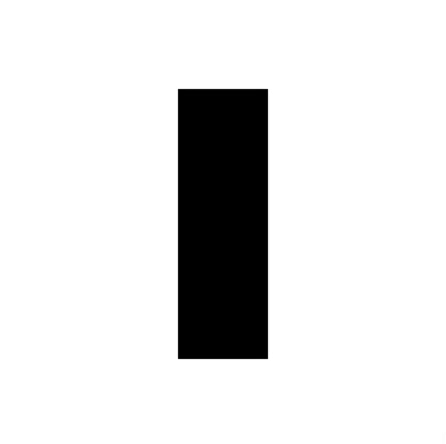

# Game of Life using Python and OpenCV

<div align="center">
    
</div>

This is an implementation of Conway's Game of Life using Python and OpenCV. The Game of Life is a cellular automaton devised by the British mathematician John Horton Conway in 1970. The game is a zero-player game, meaning that its evolution is determined by its initial state, requiring no further input.

## Features

- Interactive grid size selection.
- Supports various predefined patterns (e.g., blinker, toad, beacon, glider, light-weight spaceship, Gosper glider gun).
- Adjustable speed control using a trackbar.
- Visual representation of the grid using OpenCV.

## Requirements

- Python 3.x
- OpenCV
- NumPy

## Installation

First, ensure you have Python 3.x installed. Then, install the required packages using pip:

```sh
pip install numpy opencv-python
```

## Usage

1. **Clone the repository:**

   ```sh
   git clone https://github.com/yourusername/GameOfLife.git
   cd GameOfLife
   ```

2. **Run the script:**

   ```sh
   python game_of_life.py
   ```

3. **Follow the prompts:**

   - Enter the grid dimension (e.g., 20 for a 20x20 grid).
   - Enter the type of pattern to be initialized (e.g., blinker, toad, beacon, glider, light-weight spaceship, gosper glider gun).

4. **Interact with the window:**

   - Use the trackbar to adjust the speed of the simulation.
   - Press `ESC` to exit the simulation.

## Contributing

Feel free to open issues or submit pull requests for any improvements or bug fixes.

## License

This project is licensed under the MIT License. See the [LICENSE](LICENSE) file for details.

## Acknowledgments

- John Horton Conway for creating the Game of Life.
- OpenCV and NumPy communities for providing the tools to build this project.

---

Enjoy experimenting with different patterns and observing how they evolve over time! If you have any questions or suggestions, please feel free to reach out.
